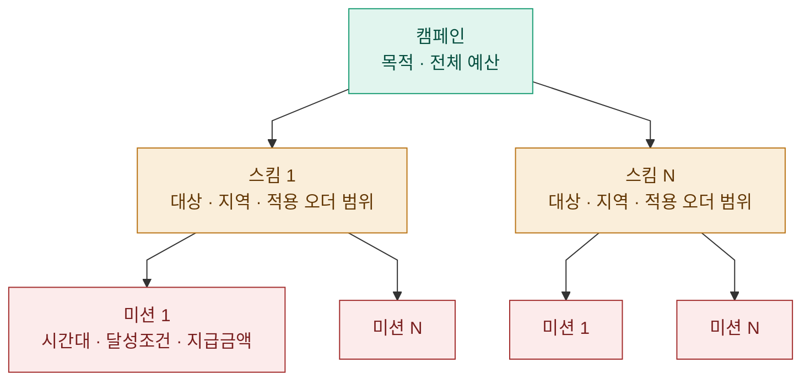
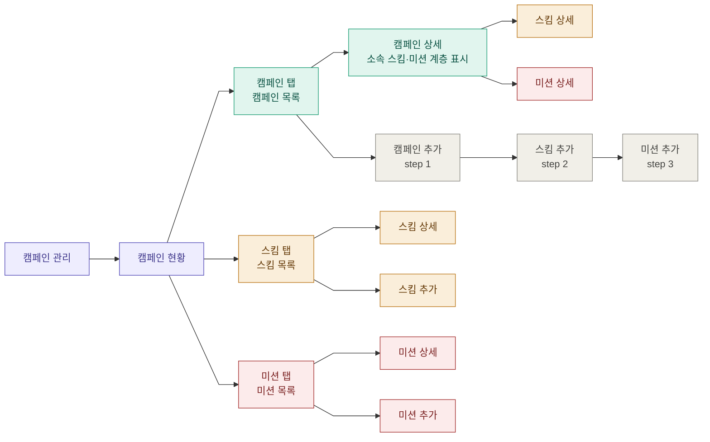

[ITSMCHG-31459](https://vroong-jira.atlassian.net/browse/ITSMCHG-31459)

> **제품·목업 기준 문서:** [`부릉-인트라-PRD.md`](./부릉-인트라-PRD.md) · [`campaign-intra-mockup.html`](./campaign-intra-mockup.html)  
> 이 파일은 **노션 원문과 동일한 정보 구조**를 유지하되, 저장소에서는 읽기 쉬운 마크다운으로만 보관한다.

---

## 1. 사용자 범위

| 사용자 | 설명 |
| --- | --- |
| 운영 관리자(3PL사업팀, 사업관리팀, BTF) | 인트라에서 `정적` 미션 캠페인을 등록·관리하는 내부 관리자 |

---

## 2. 캠페인 상태 정의

### 캠페인 상태

캠페인 자체에는 상태값이 저장되지 않는다. **하위 미션 상태의 집계로 실시간 산출**한다.

| 산출 결과 | 조건 |
| --- | --- |
| 예정 | 연결된 모든 미션이 미션 예정 / 미션 0개 |
| 진행 | 연결된 미션 중 하나라도 미션 진행 시 자동 전환 |
| 완료 | 연결된 모든 미션 종료 시 자동 전환 |

### 미션 상태

| 상태 | 설명 |
| --- | --- |
| 미션 예정 | 미션 시작일 전 |
| 미션 진행 | 미션 시작일 도달 시 자동 전환 |
| 미션 완료 | 미션 종료일 경과 시 자동 전환 |

---

## 3. 캠페인 시스템 구조

2026-04-22 기준, 캠페인·스킴·미션은 새로 도입되는 개념이다. 각 개체의 관계와 설정 항목을 아래에 정의한다.



| 개체 | 역할 | 주요 설정 항목 |
| --- | --- | --- |
| 캠페인 | 운영 목적·예산의 최상위 단위, 1개 캠페인에 N개 스킴 | 캠페인명, 목적, 전체 예산 |
| 스킴 | 타겟·지역 등 공통 조건 묶음, **여러 캠페인이 공유 가능 (N:M)** | 지역/ZONE, 적용 대상(라이더 유형, 세그먼트(프렌즈)), **적용 오더 범위** |
| 미션 | 실제 라이더에게 노출되는 인센티브 단위, 1개 스킴에 N개 미션 | 기간, 시간대, 미션 오픈일, 달성조건, 지급구조, 지급금액 |

- 스킴이 없으면 미션을 생성할 수 없고, 캠페인이 없으면 스킴을 생성할 수 없다.
- 자주 바뀌는 설정(시간대·건수·금액)을 미션 레벨에 두어 상위 설정을 반복 입력하는 비효율을 제거한다.

**왜 3-depth 구조로 가나요? (노션 콜아웃 요지)**

- 카카오·당근 등 주요 광고 플랫폼이 공통으로 사용하는 캠페인 → 그룹 → 소재 3-depth 구조와 동일한 정석 패턴으로, 운영자 멘탈모델과 일치한다.
- 타겟·지역·기간 등 공통 조건을 스킴에 한 번만 설정하면 하위 미션 전체에 적용되어 반복 입력 비효율이 제거되고, 캠페인 단위로 예산·성과를 통합 관리할 수 있다.
- 추후 프로모션·리워드가 추가될 때 자연스럽게 확장 가능하며, 기존 구조 변경이 필요 없다.

---

## 4. 메뉴 구조



| Depth | 메뉴 | 설명 | 진입 방식 |
| --- | --- | --- | --- |
| L1 | 캠페인 현황 (=캠페인탭) | 탭 3개(캠페인·스킴·미션)로 구성된 통합 관리 화면 · 캠페인 목록 조회 + 캠페인 추가 | LNB 클릭 |
| L2 | 캠페인 상세 | 캠페인 기본정보 + 소속 스킴·미션 계층 형태로 표시 | 캠페인 목록에서 캠페인명 클릭 |
| L3 | └ 스킴 상세 | 캠페인 상세 내 소속 스킴 조건 확인·수정 | 캠페인 상세에서 스킴 상세 클릭 · ★ 스킴 탭 > 스킴 상세와 동일 화면 |
| L3 | └ 미션 상세 | 캠페인 상세 내 소속 미션 조건 확인·수정 | 캠페인 상세에서 미션 상세 클릭 · ★ 미션 탭 > 미션 상세와 동일 화면 |
| L3 | [STEP1] 캠페인 추가 | 캠페인 목적·예산 입력 | 캠페인 탭 + 추가 버튼 (*위저드 방식) |
| L3 | [STEP2] 스킴 추가 | 타겟·지역·기간 설정 | 캠페인 추가 완료 후 자동 진입, 또는 스킴 탭 + 스킴 추가 버튼 |
| L3 | [STEP3] 미션 추가 | 달성조건·지급금액 설정 | 스킴 추가 후 "저장 후 미션 추가", 또는 미션 탭 + 미션 추가 버튼 |
| L2 | 스킴 탭 | 스킴 목록 조회 + 스킴 추가 | 캠페인 현황 내 스킴 탭 클릭 |
| L3 | └ 스킴 상세 | 스킴 조건 상세 확인·수정 | 스킴 목록에서 스킴명 클릭 · ★ 캠페인 상세 > 스킴 상세와 동일 화면 |
| L2 | 미션 탭 | 미션 목록 조회 + 미션 추가 | 캠페인 현황 내 미션 탭 클릭 |
| L3 | └ 미션 상세 | 미션 조건 상세 확인·수정 | 미션 목록에서 미션명 클릭 · ★ 캠페인 상세 > 미션 상세와 동일 화면 |

> ★ 진입 경로가 달라도 동일한 상세 화면이 노출됨

스킴 상세·미션 상세는 캠페인의 서브메뉴(ㄴ 스킴, ㄴ 미션)로 존재한다. (예: 계약 관리의 서브메뉴와 동일한 메뉴 형태)

- 추후 프로모션·리워드 메뉴 추가 예정

---

## 5. 기능 요구사항

### 5-1. 캠페인 현황 (=캠페인 탭)

등록된 캠페인과 하위 스킴·미션을 통합 조회하는 화면. 캠페인 탭 / 스킴 탭 / 미션 탭으로 구성.

#### 검색 조건

| 항목 | 설명 | 입력 형태 |
| --- | --- | --- |
| 상태 | 전체 / 예정 / 진행 / 완료 | 드롭다운 |
| 목적 | 전체 / 전환 / 활성화 | 드롭다운 |
| 캠페인명 | 캠페인명 키워드 검색 | 텍스트 |
| 검색 버튼 | - | 버튼 |
| 초기화 버튼 | - | 버튼 |

#### 캠페인 목록 항목

| 항목 | 설명 | 입력 형태 | 비고 |
| --- | --- | --- | --- |
| 캠페인명 | 캠페인 이름 | 텍스트 (읽기전용) | 클릭 시 캠페인 상세로 이동 |
| 목적 | 전환 / 활성화 | 텍스트 (읽기전용) | |
| 스킴 수 | 하위 스킴 수 | 텍스트 (읽기전용) | |
| 미션 수 | 하위 미션 수 | 텍스트 (읽기전용) | |
| 총 예산 | 설정된 총 예산 | 텍스트 (읽기전용) | |
| 소진액 | 현재까지 지급된 총 금액 | 텍스트 (읽기전용) | |
| 남은 예산 | 잔여 예산 + 잔여 비율 | 텍스트 + 프로그레스바 | |
| 캠페인 기간 | 소속된 미션 중 가장 빠른 시작일, 가장 늦은 종료일 표기 | 텍스트 (읽기전용) | |
| 캠페인 상태 | 예정 / 진행 / 완료 | 텍스트 (읽기전용) | |
| 총 건수 | 조회된 캠페인 수 | 텍스트 (읽기전용) | 목록 우측 하단 표시 (예: 총 9건) |
| + 추가 | (노션 표기) 추가 화면 진입 버튼 | 버튼 | 노션 원문 표에는 "미션 추가 화면 진입"으로 적혀 있으나, 캠페인 탭 문맥상 **캠페인 추가**로 해석하는 것이 자연스럽다. 확정은 기획 확인. |

---

### 5-2. 캠페인 상세

캠페인 목록에서 캠페인명 클릭 시 진입. 캠페인 설정 정보와 소속 스킴·미션 상세가 노출된다.

| 항목 | 설명 | UI |
| --- | --- | --- |
| 캠페인명 | 캠페인 이름 | 텍스트 (읽기전용) |
| 목적 | 전환 / 활성화 | 텍스트 (읽기전용) |
| 총 예산 | 캠페인 전체 편성 예산 | 텍스트 (읽기전용) |
| 소진액 / 남은 예산 | 잔여 예산 + 잔여 비율 | 텍스트 + 프로그레스바 |
| 상태 | 예정 / 진행 / 완료 | 뱃지 |

**※ 소속 스킴·미션 계층 표시**

캠페인 상세 안에 하위 스킴과 미션이 계층 구조로 표시된다. 스킴·미션 서브 메뉴 클릭 시 각 상세로 진입하고 상세 내용이 노출된다. (*상세 화면은 노션 문서 내 STEP2 스킴 설정, STEP3 미션 설정 앵커와 동일)

```
캠페인
└ 스킴 A
    └ 미션 1
    └ 미션 2
└ 스킴 B
    └ 미션 3
```

---

### 5-3. 스킴 탭 : 스킴 목록 조회 + 스킴 추가 진입

#### 검색 조건

| 항목 | 설명 | 입력 형태 |
| --- | --- | --- |
| 소속 캠페인 | 연결된 캠페인 기준 검색 | 드롭다운 |
| 스킴명 | 스킴명 키워드 검색 | 텍스트 |
| 검색 버튼 | - | 버튼 |
| 초기화 버튼 | - | 버튼 |

#### 목록 항목

| 항목 | 설명 | 입력 방식 |
| --- | --- | --- |
| 스킴명 | 스킴 이름 | 텍스트 클릭 시 스킴 상세로 이동 |
| 캠페인명 | 소속 캠페인 (N개) | 텍스트 리스트 (읽기전용) |
| 적용대상 | 라이더 유형 + 세그먼트 | 텍스트 (읽기전용) |
| 지역 | 적용 지역/ZONE | 텍스트 (읽기전용) |
| 적용오더 범위 | 전체/프랜차이즈/로컬/플랫폼 | 텍스트 (읽기전용) |
| + 스킴 추가 | 스킴 추가 화면 진입 | 버튼 |

---

### 5-4. 미션 탭 : 미션 목록 조회 + 미션 추가 진입

#### 검색 조건

| 항목 | 설명 | 입력 형태 |
| --- | --- | --- |
| 소속 스킴 | 연결된 스킴 기준 검색 | 드롭다운 |
| 미션명 | 미션명 키워드 검색 | 텍스트 |
| 기간 | 시작일 ~ 종료일 | 날짜선택 |
| 검색 버튼 | - | 버튼 |
| 초기화 버튼 | - | 버튼 |

#### 목록 항목

| 항목 | 설명 | 입력 방식 |
| --- | --- | --- |
| 미션명 | 미션 이름 | 텍스트, 클릭 시 미션 상세로 이동 |
| 스킴명 | 소속 스킴 | 텍스트 (읽기전용) |
| 지급 구조 | 단일목표형 / 단계형 | 텍스트 (읽기전용) |
| 시간대 | 적용 시간대 | 텍스트 (읽기전용) |
| 기간 | 시작일 ~ 종료일 | 텍스트 (읽기전용) |
| 미션 상태 | 미션 예정 / 미션 진행 / 미션 완료 | 뱃지 |
| + 미션 추가 | 미션 추가 화면 진입 | 버튼 |

---

### 5-5. 캠페인 추가

캠페인 추가는 캠페인 → 스킴 → 미션 순서로 이어지는 **위저드 방식**으로만 진행된다. 상단에 단계 진행 상태가 표시되며, 각 단계 완료 후 다음 단계로 자동 진입한다.

#### ⓵ 캠페인 설정

- 상단 진행 단계 표시: **① 캠페인** → ② 스킴 → ③ 미션 → ④ 완료

| 항목 | 설명 | 필수 | 입력 형태 | 동작 및 Validation |
| --- | --- | --- | --- | --- |
| 캠페인명 | 캠페인 이름 | O | 텍스트 | 최대 50자 |
| 목적 | 캠페인 운영 목적 | O | Radio (전환 / 활성화) | 전환: 신규 라이더 유입·첫 배달 유도 / 활성화: 활동 촉진 |
| 예산한도 | 캠페인 총 예산 · 시스템이 지급 금액 기준으로 최대 참여 인원 자동 산정 | O | 숫자(원) | 0원 초과 · 지급 금액 입력 완료 시 `최대 참여 가능 인원 N명 · 1인당 지급 N원` 안내 (*단계형은 최고 단계 지급 금액 기준) |

**하단 버튼**

| 버튼 | 동작 |
| --- | --- |
| 취소 | 입력 중단 확인 모달, 확인 시 캠페인 현황으로 이동 (*입력값 미저장) |
| 다음 | 입력값 보관 후 스킴 추가 STEP2로 자동 진입 (*위저드 종료 시점에 일괄 저장) |

#### ⓶ 스킴 설정

기존에 생성된 스킴을 불러오거나, 새로 입력할 수 있다.

**스킴 불러오기:** 드롭다운에서 기존 스킴 선택 시 해당 스킴의 설정값이 **읽기 전용**으로 표시된다. 불러온 스킴은 수정 불가하며 그대로 연결된다.

| 항목 | 설명 | 필수 | 입력 형태 | 동작 및 Validation (요지) |
| --- | --- | --- | --- | --- |
| 스킴명 | 스킴 이름 | O | 텍스트 | 최대 50자 |
| 적용대상 유형 | 일반기사(프렌즈) / NVP지점기사 | O | 체크박스 | 1개 이상 · 프렌즈 선택 시 세그먼트 영역 펼침 |
| 세그먼트 - 활동 수준 | 고/저 물량 × 고/저 품질 조합 | O | 체크박스 | 1개 이상 |
| ZONE | 적용 ZONE | O | 전체 토글 + 드롭다운 | NVP 선택 시 노출 등 (노션 표 전문 참고) |
| 라이더 활동 지역 | 활동 지역 기준 | O | 전체 토글 + 시도/시군구 + 직접 추가 | 프렌즈 선택 시 노출 |
| 미션 대상 지역 | 픽업지 기준 지역 | O | 전체/다중 선택 + 읍면동 단계 | 프렌즈 선택 시 노출 |
| 적용 오더 범위 | 전체/로컬/프랜차이즈/플랫폼 | O | 드롭다운 | 프랜차이즈 선택 시 프랜차이즈 리스트 추가 노출 |
| 스킴 불러오기 | 기존 스킴 선택 | X | 버튼+드롭다운 | 선택 시 하위 필드 읽기 전용 · 저장 시 연결만 |

**하단 버튼**

| 버튼 | 동작 |
| --- | --- |
| 이전 | STEP1로 이동 (*입력값 보존) |
| 넘어가기 | 스킴 추가 없이 STEP3 미션 설정으로 진입, STEP3 미션 입력 비활성화 ([넘어가기]/[이전]만 가능) |
| 다음 | 입력값 보관 후 STEP3으로 진입, 위저드 종료 시점에 일괄 저장 |

#### ⓷ 미션 설정

기존 미션을 복사하거나, 새로 입력할 수 있다. 미션 설정은 **적용조건, 달성조건, 운영 조건**을 입력한다.

**미션 복사:** 드롭다운에서 기존 미션 선택 시 설정값이 복사되어 채워진다. 복사된 값은 수정 가능하며 저장 시 **새 미션**으로 생성된다 (*원본 미션 불변). 목록에는 **상위 캠페인 목적과 동일한 미션만** 노출.

**1) 적용 조건 (필드 요지)**

| 필드 | 설명 | 필수 | 입력 형태 | Validation 요지 |
| --- | --- | --- | --- | --- |
| 미션명 | 미션 이름 | O | 텍스트 | 최대 50자 |
| 미션 설명 | 미션 설명 | X | 텍스트 | **최대 1,000자** |
| 지급 구조 | 단일 목표형 / 단계형 | O | Radio | 전환 목적 시 미노출 · 활성화 시 선택 |
| 미션 공개일 | 앱 노출일 | O | 날짜 | **공개일 ≥ 오늘** |
| 기간 설정 | 적용 기간 | O | 날짜 범위 | **시작일 ≥ 오늘**, **종료일 > 시작일** |
| 시간대 설정 | 적용 시간대 | X | 구간 추가+태그 | 활성화만 · 중복 불가 · 미설정 시 전일 |
| 가입 후 유효 일수 | 전환용 | O | 숫자(일) | 전환만 노출 · **0 초과** |
| 미션 복사 | 기존 미션 불러오기 | X | 버튼+드롭다운 | 상기 복사 규칙 |

**2) 달성조건**

- **전환:** 가입 후 유효 일수 내 목표 건수 달성 시 1회 지급 — 첫 배달 목표 건수, 1회 지급 금액 (0 초과 정수)
- **활성화 · 단계형:** 미션 종료 다음날 카운팅 후 **달성한 최고 단계** 금액 1회 지급 — 목표 건수/지급 금액 행 추가, 최대 10단계, 오름차순 필수
- **활성화 · 단일 목표형:** 미션 종료 다음날 카운팅 후 목표 건수 달성 시 1회 지급

**3) 운영 조건**

| 항목 | 설명 | 필수 | 입력 형태 | Validation |
| --- | --- | --- | --- | --- |
| 휴무 조건 | 미션 기간 내 최대 휴무 횟수 (오더받기 ON 없는 날 = 휴무) | X | 숫자(회) | 0 이상 정수 |
| 취소건수 조건 | 라이더 직접 배차 취소 건 | X | 숫자(건) | 0 이상 정수 |

**하단 버튼(저장)**

| 버튼 | 동작 |
| --- | --- |
| 이전 | STEP2로 이동 (*입력값 보존) |
| 넘어가기 | **캠페인 등록 확인 모달** — 확인 시 캠페인+스킴 일괄 저장 후 캠페인 상세로 이동 ("등록 후 캠페인 정보는 수정할 수 없습니다…") |
| 미션 추가 저장 | 캠페인+스킴+미션 일괄 저장 후 동일 스킴 하위에 미션 추가 화면 재진입 (연속 등록), 모달 없음 |
| 완료 | **캠페인 등록 확인 모달** — 확인 시 전체 일괄 저장 후 캠페인 상세로 이동 |

---

### 5-6. 스킴 추가

스킴 탭에서 직접 스킴 추가. **위저드와 달리 미션 추가로 자동 이어지지 않는다.** 소속 캠페인을 먼저 선택해야 저장 가능. 입력 항목은 STEP2 스킴 설정과 동일.

| 버튼 | 동작 |
| --- | --- |
| 취소 | 입력 중단 확인 → 스킴 탭 |
| 저장 | 스킴 저장 → 스킴 탭 |

---

### 5-7. 미션 추가

미션 탭에서 직접 미션 추가. 위저드와 달리 이전/다음 없음. 소속 스킴 먼저 선택. STEP3 미션 설정과 동일. 미션 복사 지원.

| 버튼 | 동작 |
| --- | --- |
| 취소 | 입력 중단 확인 → 미션 탭 |
| 저장 | 미션 저장 → 미션 탭 |

---

### 5-8. 수정 정책

캠페인/스킴/미션 상세는 단일 화면에서 조회·수정 가능.

| 조회화면 진입 시 | 동작 |
| --- | --- |
| 수정 가능 조건 충족 시 모든 필드가 입력 필드 형태 | 바로 수정 가능 |
| 변경 후 [저장] | 저장 완료 토스트, 동일 페이지 유지 |

**대상별 수정 가능 조건**

| 대상 | 수정 가능 조건 |
| --- | --- |
| 캠페인 | **영구 수정 불가** (*캠페인 상세는 항상 조회 전용). 단, **하위 스킴 연결(추가/해제)**는 허용 |
| 스킴 | **참조 캠페인 0개**일 때만 수정 가능 |
| 미션 | **미션 공개일 미도래 + 미션 예정** 상태일 때만 수정 가능 |

- 조건 미충족 시 모든 필드 비활성화(읽기전용).

---

### 5-9. 삭제 정책

| 대상 | 삭제 가능 조건 |
| --- | --- |
| 캠페인 | 삭제 불가 |
| 스킴 | 연결된 미션 0개 + 참조 캠페인 0개 |
| 미션 | 예정 상태 |

---

### 5-10. 생성 제약 정책

| 대상 | 제약 조건 |
| --- | --- |
| 캠페인 | 생성 후 수정 불가 |
| 스킴 | 캠페인이 존재해야 생성 가능, 반드시 캠페인 하위 |
| 미션 | 스킴이 존재해야 생성 가능, 반드시 스킴 하위 |

---

## 6. M캐시 지급 처리 플로우

### 참여·지급 (노션 mermaid 요지)

- 미션 기간 내 첫 배송 시 참여 반영, 실시간 카운트, 최대 참여 인원 도달 시 미션 즉시 종료(진행→완료).
- 미션 종료 **다음날 배치**에서 오더 카운트 집계 → 달성 여부 → (휴무/취소 조건 설정 시 추가 검증) → 지급 요청.

#### 6-1. 지급 판단 기준

| 목적 | 지급 구조 | 지급 기준 |
| --- | --- | --- |
| 활성화 | 단일 | 미션 종료 다음날 카운팅 후 목표 건수 달성 시 1회 지급 |
| 활성화 | 단계 | 미션 종료 다음날 카운팅 후 달성한 **최고 단계** 금액 1회 지급 |
| 전환 | 해당없음 | 가입 후 유효 일수 내 목표 건수 달성 시 1회 지급 |

**선택 조건 (*설정된 경우에만 검증)**

| 조건 | 기준 | 미충족 시 |
| --- | --- | --- |
| 휴무 조건 | 미션 기간 내 총 휴무 횟수 > 설정값 | 지급 제외 |
| 취소건수 조건 | 미션 기간 내 총 취소 건수 > 설정값 | 지급 제외 |

#### 6-2 ~ 6-4 (요지)

- **2026-04-20 노션 기준:** 참여 확정 = 미션 기간 내 **오더를 잡는 시점** · 달성 카운트 = **배송 완료** 기준 집계.
- 최대 참여 인원 = 1인당 예산 ÷ 최고 지급 금액 (단계형은 최고 단계, 단일/전환은 해당 지급 금액).
- 정원 도달 시 즉시 미션 종료, 이후 배송자는 제외.
- 지급 처리는 배치 기반 후정산(미션 종료 다음날). 라이더 정보는 일배치로 마케팅 DB 적재.

---

## 7. 라이더 유형 세그먼트 산정 기준 — 일반기사(프렌즈) 한정

### 7-1. 산정 시점

- 미션 시작일 기준 **직전 2주** 데이터 사용 (등록·공개 시점 아님).

### 7-2. 세그먼트 대상 라이더

| 조건 | 기준 |
| --- | --- |
| 재직 상태 | AGENT_RECENT_EMPLOY_STATUS = '재직' |
| 라이더 유형 | EMPLOYMENT_TYPE = '부릉프렌즈' |
| 첫 수행 완료 | 배달 완료 이력 있음 |
| 최근 활동 | 직전 2주 내 배달 완료 1건 이상 |

### 7-3 ~ 7-4

- SLA: 고SLA ≥ 90%, 저SLA < 90% (직전 2주).
- 물량: 고물량 = 일평균 배달 ≥ 3건, 저물량 < 3건.
- 세그먼트 4분류: 저SLA+저물량, 저SLA+고물량, 고SLA+저물량, 고SLA+고물량.

### 7-5. 처리 방식

- 미션 시작 시 마케팅 서버가 세그먼트 조회·적용, **시작 시점 스냅샷 고정**.
- 직전 2주 이력 없으면 세그먼트 산정 제외 → **해당 미션 참여 대상에서 제외**.

---

## 8. Mock-up

[*Mock-up 바로가기*](https://sujinkim91.github.io/campaign-system/intra/campaign-intra-mockup.html)

디자인 작업이 예정되어 있어 현재 목업과 실제 구현 간 차이가 발생할 수 있다. 해당 목업은 참고용으로만 활용.

---

## 부록: Notion 토의 링크 등 (MCP 원문에만 있던 표시)

- 미션 공개일, 전환 지급 문구 등에 **discussion://** URL이 붙어 있었다. 저장소 GFM에는 생략했으며, 노션에서 댓글 스레드를 확인하면 된다.
