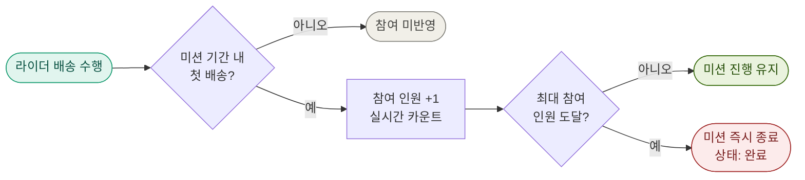
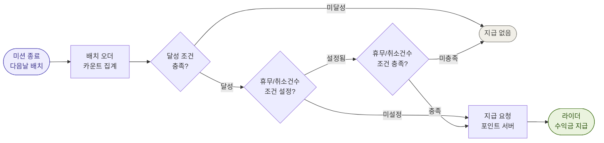

## 1. 사용자

| 사용자 | 설명 |
|---|---|
| 운영 관리자 | 인트라에서 미션 캠페인을 등록·관리하는 내부 운영자 |

---

## 2. 캠페인 상태 정의

| 상태 | 설명 |
|---|---|
| 예정 | 등록 완료 후 시작일 전 |
| 진행 | 시작일 도달 시 자동 전환 |
| 완료 | 종료일 경과 시 자동 전환 |
| 중단 | 관리자 off 처리 |

**상태 변경 기준**

| 현재 상태 | 조건 | 변경 후 상태 | 비고 |
|---|---|---|---|
| 예정 | 시작일 도달 | 진행 | 자동 |
| 진행 | 종료일 경과 | 완료 | 자동 |
| 예정 / 진행 | 관리자 off | 중단 | 수동 |
| 중단 | 관리자 on + 현재 시각 < 시작일 | 예정 | 아직 시작 전이므로 예정으로 복구 |
| 중단 | 관리자 on + 시작일 ≤ 현재 시각 ≤ 종료일 | 진행 | 기간 내이므로 즉시 진행으로 복구 |
| 중단 | 종료일 경과 | 완료 | 자동. on 불가 |

---

## 3. LNB 메뉴 구조

| depth 1 | depth 2 | 화면 | 진입 방식 |
|---|---|---|---|
| 캠페인 관리 | 캠페인 목록 | 캠페인 목록 | LNB 클릭 |
| 캠페인 관리 | 캠페인 목록 | 캠페인 추가 | 캠페인 목록 내 + 추가 버튼 클릭 |
| 캠페인 관리 | 캠페인 목록 | 캠페인 상세 - 캠페인 현황 탭 | 캠페인 목록에서 캠페인 클릭 |
| 캠페인 관리 | 캠페인 목록 | 캠페인 상세 - 스킴 탭 | 캠페인 상세 내 스킴 탭 클릭 |
| 캠페인 관리 | 캠페인 목록 | 스킴 추가 | 스킴 탭 내 + 추가 버튼 클릭 |
| 캠페인 관리 | 캠페인 목록 | 스킴 상세 | 스킴 탭에서 스킴 클릭 |
| 캠페인 관리 | 캠페인 목록 | 캠페인 상세 - 미션 탭 | 캠페인 상세 내 미션 탭 클릭 |
| 캠페인 관리 | 캠페인 목록 | 미션 추가 | 미션 탭 내 + 추가 버튼 클릭 |
| 캠페인 관리 | 캠페인 목록 | 미션 상세 | 미션 탭에서 미션 클릭 |

- 캠페인 추가·스킴 추가·미션 추가는 LNB에 직접 노출되지 않음
- 추후 프로모션·리워드 메뉴 추가 예정

---

## 4. 기능 요구사항

### 4-1. 캠페인 목록

등록된 캠페인과 하위 스킴·미션을 통합 조회하는 화면.

**검색 조건**

| 항목 | 설명 | 입력 형태 |
|---|---|---|
| 상태 | 전체 / 예정 / 진행 / 완료 / 중단 | 드롭다운 |
| 목적 | 전체 / 전환 / 활성화 | 드롭다운 |
| 캠페인명 | 캠페인명 키워드 검색 | 텍스트 |
| 검색 버튼 | - | 버튼 |
| 초기화 버튼 | - | 버튼 |

**목록 항목**

| 항목 | 설명 | 입력 형태 | 비고 |
|---|---|---|---|
| 캠페인명 | 캠페인 이름 | 텍스트 (읽기전용) | 클릭 시 캠페인 상세로 이동 |
| 목적 | 전환 / 활성화 | 텍스트 (읽기전용) | |
| 기간 | 시작일 ~ 종료일 | 텍스트 (읽기전용) | |
| 스킴 수 | 하위 스킴 수 | 텍스트 (읽기전용) | |
| 미션 수 | 하위 미션 수 | 텍스트 (읽기전용) | |
| 예산 한도 | 스킴에 설정된 총 예산 | 텍스트 (읽기전용) | |
| 소진액 | 현재까지 지급된 총 금액 | 텍스트 (읽기전용) | |
| 상태 | 예정 / 진행 / 완료 / 중단 | 뱃지 | |
| 관리 | ON / OFF 버튼 | 버튼 | 예정/진행: ON·OFF 전환 가능. OFF 클릭 시 확인 모달 노출. 완료/중단(종료일 경과): \"ON 불가\" 표시 |
| 총 건수 | 조회된 캠페인 수 | 텍스트 (읽기전용) | |
| + 추가 | 캠페인 추가 화면 진입 | 버튼 | |

---

### 4-2. 캠페인 상세

캠페인의 현황과 하위 스킴·미션 목록을 확인하는 화면.

#### 캠페인 현황

| 항목 | 설명 | 필수 | 입력 형태 | 동작 및 Validation |
|---|---|---|---|---|
| 캠페인명 | 캠페인 이름 | O | 텍스트 | 최대 50자 |

#### 스킴 탭

- 해당 캠페인에 속한 스킴 목록 노출
- 스킴명 / 타겟 / 지역 / 기간 / 예산 / 상태 항목 표시
- 스킴명 클릭 시 스킴 상세로 이동
- + 추가 버튼으로 스킴 추가 진입

#### 미션 탭

- 해당 캠페인에 속한 미션 목록 노출 (전체 스킴 하위 미션 통합)
- 미션명 / 스킴명 / 지급 구조 / 시간대 / 화주사 / 달성 조건 / 상태 항목 표시
- 미션명 클릭 시 미션 상세로 이동

---

### 4-3. 스킴 추가

캠페인 하위에 스킴을 추가하는 화면. 타겟·지역·예산·기간 등 공통 설정을 한 번만 입력.

#### 기본 정보

| 항목 | 설명 | 필수 | 입력 형태 | 동작 및 Validation |
|---|---|---|---|---|
| 스킴명 | 스킴 이름 | O | 텍스트 | 최대 50자 |
| 목적 | 캠페인 운영 목적 · **전환**: 신규 라이더 유입 유도 · **활성화**: 기존 라이더 활동 활성화 | O | 라디오 (전환 / 활성화) | |

#### 기간 및 예산

| 항목 | 설명 | 필수 | 입력 형태 | 동작 및 Validation | 조건부 표시 |
|---|---|---|---|---|---|
| 기간 설정 | 스킴 적용 기간 | O | 날짜 범위 선택 | 시작일 ≥ 오늘. 종료일 > 시작일 | 항상 |
| 미션 공개일 | 라이더에게 미션이 노출되는 날짜 | O | 날짜 선택 | 시작일 이전이어야 함 | 항상 |
| 총 예산 | 스킴 편성 총 예산 | O | 숫자 (원) | 0원 초과. 지급 금액 입력 완료 시 `최대 참여 인원 N명 · 1인당 예산 N원` 자동 노출 | 항상 |
| 가입 후 유효 일수 | 가입일로부터 미션 참여 가능 기간 | O | 숫자 (일) | 0 초과 정수 | 전환 목적 시 |

#### 적용 대상

| 항목 | 설명 | 필수 | 입력 형태 | 동작 및 Validation | 조건부 표시 |
|---|---|---|---|---|---|
| 적용대상 유형 | 대상 라이더 유형 | O | 체크박스 (일반기사(프렌즈) / NVP지점기사) | 1개 이상 선택. 일반기사(프렌즈) 선택 시 세그먼트 노출 | 항상 |
| 세그먼트 - 활동 수준 | 라이더 세부 분류 조건 | O | 체크박스 (고물량·고품질 / 고물량·저품질 / 저물량·고품질 / 저물량·저품질) | 1개 이상 선택 | 일반기사(프렌즈) 선택 시 |
| ZONE | 적용 ZONE (NVP지점기사) | O | 드롭다운. 태그 형태 노출, × 삭제 | 1개 이상 선택 | NVP지점기사 선택 시 |
| 미션 대상 지역 | 오더의 픽업지 기준 지역 (일반기사(프렌즈)) | O | 시/도 → 시/군/구 단계별 드롭다운. 전체지역 버튼 제공 | 전체지역 선택 시 전체 적용. 그 외 1개 이상 필수 | 일반기사(프렌즈) 선택 시 |
| 기사 활동 지역 | 라이더가 설정한 활동 지역 (일반기사(프렌즈)) | O | 시/도 → 시/군/구 단계별 드롭다운. 전체지역 버튼 제공 | 전체지역 선택 시 전체 적용. 그 외 1개 이상 필수 | 일반기사(프렌즈) 선택 시 |

---

### 4-4. 미션 추가

스킴 하위에 미션을 추가하는 화면. 시간대·화주사·달성조건·지급금액 설정.

#### 기본 정보

| 항목 | 설명 | 필수 | 입력 형태 | 동작 및 Validation |
|---|---|---|---|---|
| 미션명 | 미션 이름 | O | 텍스트 | 최대 50자 |
| 미션 설명 | 미션에 대한 설명 | X | 텍스트 | - |
| 지급 구조 | 보상 지급 방식 · **단일목표형**: 목표 건수 달성 시 설정 금액 1회 지급 · **단계형**: 미션 종료 후 달성한 최고 단계 금액 1회 지급 | O | 라디오 (단일목표형 / 단계형) | 전환 목적 스킴 하위 미션은 단일목표형 고정 |

#### 적용 조건

| 항목 | 설명 | 필수 | 입력 형태 | 동작 및 Validation | 조건부 표시 |
|---|---|---|---|---|---|
| 시간대 설정 | 적용 시간대 | X | 시작~종료 시각 + 추가 버튼. 태그 형태 노출, × 삭제 | 중복 불가. 미설정 시 전일 적용 | 활성화 목적 스킴 하위 미션 |
| 화주사 | 적용 화주사 범위 · **전체**: 모든 상점 오더 · **로컬**: 프랜차이즈 ID 없는 상점 · **프랜차이즈**: 프랜차이즈 ID 존재하는 상점. 세부 항목 프랜차이즈 ID별 구분 · **플랫폼**: 요기요 OD 오더 | X | 드롭다운 (전체 / 로컬 / 프랜차이즈 / 플랫폼) | 프랜차이즈 선택 시 세부 항목 추가 노출 (프랜차이즈 전체 선택 포함) | 항상 |

#### 달성 조건

**미션 운영 기준 (선택)**

| 항목 | 설명 | 필수 | 입력 형태 | 동작 및 Validation |
|---|---|---|---|---|
| 휴무 조건 | 미션 기간 내 최대 휴무 횟수. 하루 중 오더받기 ON 상태가 한 번도 없는 날을 휴무로 산정 | X | 숫자 (회) | 0 이상 정수 |
| 취소건수 조건 | 미션 기간 내 취소 건수. 라이더가 직접 배차 취소한 건에 한정 | X | 숫자 (건) | 0 이상 정수 |

**단계형 지급 조건 (지급 구조: 단계형 선택 시)**

| 항목 | 설명 | 필수 | 입력 형태 | 동작 및 Validation |
|---|---|---|---|---|
| 목표 건수 | 단계별 달성 목표 배달 건수 | O | 숫자 (건) | 0 초과 정수. 오름차순 필수 |
| 지급 금액 | 단계별 지급 금액 | O | 숫자 (원) | 0원 초과 |
| 단계 추가 | - | - | 버튼 | 최대 10단계 |
| 단계 삭제 | - | - | 버튼 | 최소 1단계 유지 |

- 지급 기준: 미션 종료 다음날 카운팅 후 달성한 최고 단계 금액 1회 지급

**단일목표형 지급 조건**

| 항목 | 설명 | 필수 | 입력 형태 | 동작 및 Validation |
|---|---|---|---|---|
| 목표 건수 | 달성 목표 배달 건수 | O | 숫자 (건) | 0 초과 정수 |
| 1회 지급 금액 | 목표 달성 시 1회 지급 금액 | O | 숫자 (원) | 0원 초과 |

- 지급 기준 (활성화): 미션 종료 다음날 카운팅 후 목표 건수 달성 시 1회 지급
- 지급 기준 (전환): 가입 후 유효 일수 내 목표 건수 달성 시 1회 지급

#### 저장

| 항목 | 설명 | 입력 형태 | 동작 및 Validation |
|---|---|---|---|
| 목록으로 | 추가 취소 후 미션 목록으로 이동 | 버튼 | 입력 중단 확인 모달 노출. 확인 시 목록으로 이동 (입력값 미저장) |
| 저장 | 미션 저장 | 버튼 | 유효성 검증 통과 시 저장 처리 + 조회 모드로 전환. 실패 시 실패 사유 모달 노출 |

#### 조회 모드

저장 완료 후 조회 모드로 전환. 예정 상태인 경우 수정 가능. 진행/완료/중단 상태인 경우 읽기전용.

---

### 4-5. 수정 정책

- 스킴: 예정 상태인 스킴은 모든 항목 수정 가능. 진행/완료/중단 상태에서는 수정 불가
- 미션: 예정 상태인 미션은 모든 항목 수정 가능. 진행/완료/중단 상태에서는 수정 불가
- ON/OFF 제어로 스킴·미션 단위 운영 중단/재개 가능 (예정/진행 상태에서만)

---

## 5. 지급 처리 플로우

**실시간 참여 인원 관리**

**배치 지급 처리**

### 5-1. 지급 판단 기준

| 목적 | 지급 구조 | 지급 기준 |
|---|---|---|
| 활성화 | 단일목표형 | 미션 종료 다음날 카운팅 후 목표 건수 달성 시 1회 지급 |
| 활성화 | 단계형 | 미션 종료 다음날 카운팅 후 달성한 최고 단계 금액 1회 지급 |
| 전환 | 해당 없음 | 가입 후 유효 일수 내 목표 건수 달성 시 1회 지급 |

**선택 조건 (설정된 경우에만 검증)**

| 조건 | 기준 | 미충족 시 처리 |
|---|---|---|
| 휴무 조건 | 미션 기간 내 총 휴무 횟수 > 설정값. 하루 중 오더받기 ON 상태가 한 번도 없는 날을 휴무로 산정 | 지급 제외 |
| 취소건수 조건 | 미션 기간 내 총 취소 건수 > 설정값. 라이더 직접 배차 취소 건에 한정 | 지급 제외 |

### 5-2. 미션 참여 인원 관리

**참여 확정 기준**
- 미션 기간 내 오더를 잡는 시점에 참여 확정
- 달성 카운트는 배송 완료 기준으로 집계

**최대 참여 인원 산정**

| 지급 구조 | 산정 기준 | 예시 |
|---|---|---|
| 활성화 - 단계형 | 총 예산 ÷ 최고 단계 지급 금액 | 예산 1,000,000원 / 최고 단계 10,000원 = 최대 100명 |
| 활성화 - 단일목표형 | 총 예산 ÷ 지급 금액 | 예산 1,000,000원 / 지급 5,000원 = 최대 200명 |
| 전환형 | 총 예산 ÷ 지급 금액 | 예산 1,000,000원 / 지급 10,000원 = 최대 100명 |

**정원 도달 시 처리**
- 참여 인원이 최대 참여 인원에 도달하면 즉시 미션 종료 처리
- 종료 시점 이후 배송을 수행한 라이더는 미션 참여에서 제외
- 미션 상태: 진행 → 완료로 자동 전환

### 5-3. 예산 처리

- 최대 참여 인원 = 총 예산 ÷ 최고 지급 금액 기준으로 사전 산정
- 정원 도달 시 즉시 미션 종료. 이후 참여자는 미션에서 제외
- 예산 소진은 정원 도달과 동일한 시점에 처리됨 — 별도 소진 순서 없음

### 5-4. 시스템 처리 기준

- 라이더 정보는 일배치로 마케팅 DB에 적재
- 지급 처리는 배치 기반 후정산 (미션 종료 다음날)

---

## 6. 세그먼트 산정 기준 (일반기사(프렌즈))

> 세부 기준값은 정책서 참고. 아래는 시스템 구현 기준.

### 6-1. 산정 시점

- 미션 시작일 기준 직전 2주 데이터 사용
- 미션 등록, 오픈 시점이 아닌 미션 시작일 기준으로 산정

### 6-2. 세그먼트 대상 라이더

아래 조건을 모두 충족하는 라이더에 한해 세그먼트를 산정한다.

| 조건 | 기준 |
|---|---|
| 재직 상태 | AGENT_RECENT_EMPLOY_STATUS = '재직' |
| 라이더 유형 | EMPLOYMENT_TYPE = '부릉프렌즈' |
| 첫 수행 완료 | 배달 완료 이력 있음 |
| 최근 활동 | 직전 2주 내 배달 완료 1건 이상 |

- 위 조건 미충족 라이더는 세그먼트 산정 대상에서 제외되며, 해당 미션 참여 대상에서도 제외

### 6-3. 산정 기준

**SLA 기준**

| 구분 | 기준 |
|---|---|
| 고SLA | 직전 2주간 SLA ≥ 90% |
| 저SLA | 직전 2주간 SLA < 90% |

**물량 기준**

| 구분 | 기준 |
|---|---|
| 고물량 | 직전 2주간 일평균 배달 건수 ≥ 3건 (총 배달 완료 건수 ÷ 활동 일수) |
| 저물량 | 직전 2주간 일평균 배달 건수 < 3건 |

### 6-4. 세그먼트 분류 및 라이더 비율

| 세그먼트 | 분류 기준 | 라이더 비율 |
|---|---|---|
| 저SLA + 저물량 | SLA < 90% + 일평균 < 3건 | 약 17.5% |
| 저SLA + 고물량 | SLA < 90% + 일평균 ≥ 3건 | 약 30.9% |
| 고SLA + 저물량 | SLA ≥ 90% + 일평균 < 3건 | 약 31.6% |
| 고SLA + 고물량 | SLA ≥ 90% + 일평균 ≥ 3건 | 약 20.0% |

### 6-5. 처리 방식

- 미션 시작일 기준 직전 2주 데이터로 세그먼트 산출 후 미션 기간 동안 유저 풀 확정
- 세그먼트 값은 미션 기간 중 변경되지 않음 (시작 시점 스냅샷 고정)
- 직전 2주 배달 이력 없는 라이더는 세그먼트 산정 대상 제외 → 해당 미션 참여 대상에서 제외

---

## 7. 미결 사항 (TBD)

| 항목 | 내용 |
|---|---|
| 프랜차이즈/플랫폼 세부 항목 | 선택 가능한 항목 목록 정의 필요 |
| ZONE 목록 | 선택 가능한 ZONE 항목 정의 필요 |
